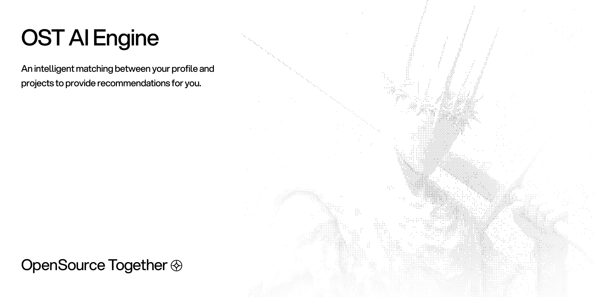

Part of the [OpenSource Together](https://github.com/opensource-together) platform.  

   

    

---

## Status

This project is in progress state, build in public available here: [@Xspidey](https://x.com/spideystreet)

## Documentation

Complete [Documentation](docs/).

---

*Made with love by [@spidey](https://github.com/spideystreet) & the [OST team](https://github.com/opensource-together)*

