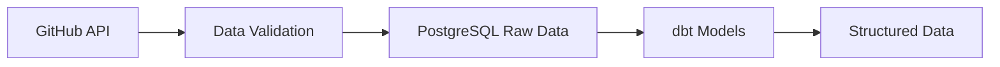
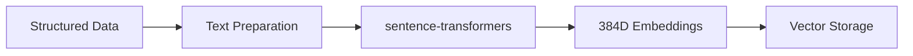
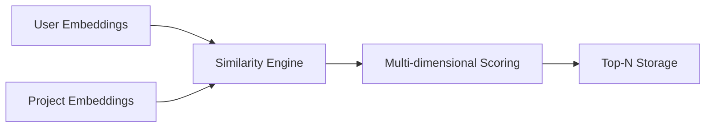
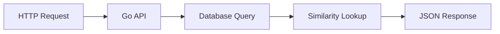

# Architecture Overview

## System Architecture

The OST Data Engine is a modern, scalable recommendation system built with a microservices architecture that combines machine learning pipelines with high-performance APIs.

## High-Level Architecture

```
┌─────────────────┐    ┌─────────────────┐    ┌─────────────────┐
│   GitHub Data   │    │   ML Pipeline   │    │   Go API        │
│                 │    │   (Dagster)     │    │                 │
│ • Repositories  │───▶│ • Embeddings    │───▶│ • REST API      │
│ • User Profiles │    │ • Similarities  │    │ • Fast Queries  │
│ • Tech Stacks   │    │ • MLflow Models │    │ • JSON Response │
└─────────────────┘    └─────────────────┘    └─────────────────┘
                                │
                                ▼
                       ┌─────────────────┐
                       │   PostgreSQL    │
                       │                 │
                       │ • Vector Store  │
                       │ • pgvector      │
                       │ • Similarities  │
                       └─────────────────┘
```

## Core Components

### 1. Data Ingestion Layer
- **GitHub API Integration**: Collects repository and user data
- **Data Validation**: Ensures data quality and completeness
- **Incremental Updates**: Efficient data refresh mechanisms

### 2. Machine Learning Pipeline (Dagster)
- **Data Preparation**: dbt models for data transformation
- **Embedding Generation**: Semantic embeddings using sentence-transformers
- **Cache Optimization**: Redis for embedding caching and performance
- **Similarity Calculation**: Multi-dimensional similarity scoring
- **Model Management**: MLflow for experiment tracking and model versioning

### 3. High-Performance API (Go)
- **RESTful Endpoints**: Clean, fast API for recommendations
- **Database Optimization**: Direct SQL queries with indexed access
- **Low Latency**: Sub-10ms response times
- **Scalable**: Designed for high throughput

### 4. Vector Database (PostgreSQL + pgvector)
- **Vector Storage**: Efficient storage of 384D embeddings
- **Similarity Search**: Fast cosine similarity calculations
- **Hybrid Indexes**: Optimized for both semantic and structured data
- **ACID Compliance**: Full transactional support

## Technology Stack

### Backend Technologies
- **Python 3.13+**: ML pipeline and data processing
- **Go 1.24+**: High-performance API server
- **PostgreSQL 15+**: Primary database with pgvector extension
- **Redis 7+**: Cache layer for ML pipeline optimization
- **Dagster**: Data orchestration and pipeline management
- **MLflow**: Model versioning and experiment tracking

### Development & Deployment
- **Docker**: Containerized deployment
- **Docker Compose**: Local development environment
- **Poetry**: Python dependency management
- **Git**: Version control

### Data Processing
- **dbt**: Data transformation and modeling
- **sentence-transformers**: Semantic embedding generation
- **NumPy**: Numerical computations
- **Pandas**: Data manipulation

## Data Flow

### 1. Data Collection


### 2. Embedding Generation


### 3. Similarity Calculation


### 4. API Serving


## Performance Characteristics

### Latency
- **API Response**: <10ms average
- **Database Queries**: <5ms with proper indexing
- **Similarity Search**: <2ms using pgvector

### Throughput
- **API Requests**: 1000+ requests/second
- **Database Operations**: 5000+ queries/second
- **Pipeline Processing**: 100+ repositories/minute

### Scalability
- **Horizontal**: Multiple API instances behind load balancer
- **Vertical**: Optimized database configuration
- **Caching**: Future Redis integration for hot data

## Security Architecture

### Data Security
- **Encryption**: TLS for all external communications
- **Authentication**: Future JWT implementation
- **Authorization**: Role-based access control
- **Input Validation**: Comprehensive parameter validation

### Infrastructure Security
- **Container Security**: Non-root user execution
- **Network Security**: Isolated Docker networks
- **Secret Management**: Environment variable encryption
- **Audit Logging**: Comprehensive access logs

## Monitoring & Observability

### Health Checks
- **API Health**: `/health` endpoint with database connectivity
- **Database Health**: Connection pool monitoring
- **Pipeline Health**: Dagster asset materialization status

### Metrics (Future)
- **Application Metrics**: Request count, response time, error rate
- **Database Metrics**: Query performance, connection pool usage
- **Infrastructure Metrics**: CPU, memory, disk usage

### Logging
- **Structured Logging**: JSON format for easy parsing
- **Log Levels**: Configurable verbosity
- **Centralized Logging**: Future ELK stack integration

## Deployment Architecture

### Development Environment
```
┌─────────────────┐    ┌─────────────────┐
│   Go API        │    │   PostgreSQL    │
│   (Port 8080)   │    │   (Port 5434)   │
└─────────────────┘    └─────────────────┘
```

### Production Environment (Future)
```
┌─────────────────┐    ┌─────────────────┐    ┌─────────────────┐
│   Load Balancer │    │   Go API Pool   │    │   PostgreSQL    │
│   (Nginx)       │───▶│   (Multiple)    │───▶│   (Primary)     │
└─────────────────┘    └─────────────────┘    └─────────────────┘
                                │
                                ▼
                       ┌─────────────────┐
                       │   PostgreSQL    │
                       │   (Replica)     │
                       └─────────────────┘
```

## Future Enhancements

### Short Term
1. **Authentication**: JWT-based API authentication
2. **Rate Limiting**: Request throttling and abuse prevention
3. **Caching**: Redis integration for frequently accessed data
4. **Metrics**: Prometheus metrics and Grafana dashboards

### Medium Term
1. **Microservices**: Split into domain-specific services
2. **Event Streaming**: Kafka for real-time data processing
3. **Machine Learning**: A/B testing for recommendation algorithms
4. **Multi-tenancy**: Support for multiple organizations

### Long Term
1. **Edge Computing**: Distributed recommendation serving
2. **Federated Learning**: Privacy-preserving model training
3. **Auto-scaling**: Kubernetes-based orchestration
4. **AI/ML Platform**: Comprehensive ML lifecycle management

## Best Practices

### Code Quality
- **Type Safety**: Strong typing in both Python and Go
- **Testing**: Comprehensive unit and integration tests
- **Documentation**: Inline code documentation and API docs
- **Code Review**: Mandatory peer review process

### Data Quality
- **Validation**: Input validation at all layers
- **Monitoring**: Data quality metrics and alerts
- **Backup**: Regular database backups and recovery testing
- **Compliance**: GDPR and data privacy compliance

### Performance
- **Optimization**: Continuous performance monitoring
- **Caching**: Strategic caching at multiple layers
- **Indexing**: Database index optimization
- **Load Testing**: Regular performance testing

## Troubleshooting

### Common Issues
1. **Database Connection**: Check connection strings and network
2. **API Performance**: Monitor query performance and indexes
3. **Pipeline Failures**: Check Dagster logs and dependencies
4. **Memory Issues**: Monitor resource usage and limits

### Debugging Tools
- **Dagster UI**: Pipeline monitoring and debugging
- **Database Tools**: Query analysis and optimization
- **API Testing**: Postman collections for endpoint testing
- **Log Analysis**: Structured log parsing and analysis
