# 🏗️ Modèle Conceptuel de Données (MCD) — Open Source Together

## 📋 Vue d'ensemble

Ce document présente le **Modèle Conceptuel de Données** d'OST, définissant les entités métier et leurs relations selon la méthode MERISE.

## Segmentation MVP vs Future

Ce MCD est organisé en deux niveaux de priorité :

- 🔴 MVP (Minimum Viable Product) : Entités et relations estimer essentielles de définir pour le lancement
- 🔵 Future : Fonctionnalités avancées à implémenter plus tard
- 🟡 À Discuter : Points nécessitant une validation équipe avant implémentation

Dans le cas ou c'est a discuter, les étiquettes 🟡🔴 ou 🟡🔵 sont la pour décider enssemble si c'est pour le MVP ou pour le future

---

## 🎯 Entités Principales

### **Entités Centrales**

- **User** : Utilisateur de la plateforme open source together 🔴
- **Project** : Initiatives open source cherchant des collaborateurs, (et a constuire une communautés ?) 🔴
- **DomainCategory** : Domaine d'application (Education, Santé, Finance, Gaming, DevTools)🟡🔴
- **ProjectType** : Format technique (Web App, API, CLI Tool, Mobile App, Browser Extension, Bot Discord) 🟡🔴
- **Skill** : Compétences métier pures (Product Management, Marketing, SEO, Community Management, Business Development)🟡🔴
- **Technology** : Outils techniques ET métier (React, Python, Figma, Slack, Notion, Docker, PostgreSQL)🔴
- **ProjectRole** : Poste ouvert avec responsabilités définies pour un projet🔴

### **Entités de Liaison**

- **Application** : Candidature pour un rôle spécifique d'un poste ouvert d'un projet (ProjectRole)🔴
- **TeamMember** : Contributeur actif validé par le owner dans un projet🔴
- **CommunityMember** : Membre de la communauté d'un projet (followers, notifications)🟡🔵
- **UserSkill** : Maîtrise d'une compétence par un utilisateur🔴
- **UserTechnology** : Maîtrise d'une technologie par un utilisateur🔴
- **UserDomainCategory** : Intérêt ou maitrise d'un domaine par un utilisateur ? 🟡🔵
- **ProjectDomainCategory** : Domaine d'application d'un projet 🟡🔵
- **ProjectSkill** : Compétence utilisée dans un projet🔴
- **ProjectTechnology** : Technologie utilisée dans un projet🔴
- **ProjectRoleSkill** : Compétence requise pour un rôle dans un projet 🟡🔴
- **ProjectRoleTechnology** : Technologie requise pour un rôle dans un projet 🔴

### **Entités de Contribution**

- **GoodFirstIssue** : Tâche de qualité adaptée aux nouveaux contributeurs avant de faire partie des teamMembers 🔴
- **Contribution** : Contribution réalisée par un utilisateur, les GFI comme les contributions en tant que teamMember 🔴
- **IssueSkill** : Compétence nécessaire pour une issue d'un projet 🟡🔴
- **IssueTechnology** : Technologie nécessaire pour une issue d'un projet 🔴

### **Entités de Support**

- **LinkedRepository** : Repository associé à un projet 🟡🔴

---

## 🔗 Relations et Cardinalités

### **Relations User-centrées**

#### 🔴 **User ↔ Project**

- **Relation** : POSSÈDE
- **Cardinalité** : `1:N` (Un utilisateur peut posséder plusieurs projets)
- **Contrainte** : Un projet a exactement un propriétaire

** 🟡 Interrogations produit :**

- 🔴Limiter le nombre de projets qu'un utilisateur peut créer ?
- 🔵Système de validation/modération pour les nouveaux projets ?
- 🔵Gestion des projets abandonnés par leur propriétaire ?

**Intérêts business :**

- 📊 **Métriques** : Nombre de projets créés par utilisateur, taux d'abandon
- 🎯 **Quality control** : Identifier les créateurs de projets de qualité
- 💼 **User personas** : Distinguer les "créateurs" des "contributeurs"

#### 🟡🔴 **User ↔ Skill**

- **Relation** : MAÎTRISE
- **Cardinalité** : `N:M` (via UserSkill)
- **Contrainte** : Un utilisateur peut maîtriser plusieurs compétences métier pures, une compétence peut être maîtrisée par plusieurs utilisateurs

**🟡Interrogations produit :**

- **Validation des compétences** :
  - 🔴 Pour le MVP, auto-déclaration libre par les utilisateurs.
  - 🔵 Évolutions futures possibles : système d'endorsement communautaire (type LinkedIn) ou validation par quiz/tests
- **Limitation du nombre de compétences** :
  - 🔴 Pour le MVP, liberté totale.
  - 🔵 Évolution future possible : limiter à 10-15 compétences principales pour améliorer la qualité du matching et éviter les profils "touche-à-tout" peu crédibles
- **Niveaux de compétence** :
  - 🔵 Évolution future possible: Faut-il distinguer les compétences principales (expert) des compétences secondaires (apprentissage) pour optimiser l'algorithme de recommandation ?

**Intérêts business :**

- 🎯 **Matching** : Base de l'algorithme de recommandation projet ↔ utilisateur
- 📈 **Analytics** : Identifier les compétences les plus demandées
- 💰 **Recrutement** : Data précieuse pour le futur dashboard recruteur

#### 🔴 **User ↔ ProjectRole**

- **Relation** : POSTULE_À
- **Cardinalité** : `N:M` (via Application)
- **Contrainte** : Un utilisateur peut postuler à plusieurs rôles, un rôle peut recevoir plusieurs candidatures

**🟡 Point à discuter avec l'équipe :**

- 🔴 ou 🔵 **`motivation_message`** dans Application :
  - **Pour** : Améliore la qualité des candidatures, aide le choix des owners
  - **Contre** : Ajoute de la friction, peut décourager les candidatures spontanées
  - **Options** : Obligatoire / Optionnel / Configurable par projet owner
  - **Décision requise** : Validation équipe sur l'approche

**🟡 Interrogations produit :**

- 🔴 Autoriser les candidatures à plusieurs rôles sur le même projet ?
- 🔴 Limiter le nombre de candidatures actives simultanées ?
- 🔵 Comment gérer les profils "en apprentissage" vs "experts" ? (Voir Intérogations produits dans UserSkill )
- 🔵 Donner aux owners la possibilité de configurer ces permissions ?

**Intérêts business :**

- 📈 **Métriques** : Taux de conversion candidature → acceptation
- 🎯 **Matching** : Améliorer l'algorithme de recommandation
- 💰 **Business** : Comprendre les patterns de succès
- 🔍 **User behavior** : Analyser les stratégies de candidature

#### 🔴 **User ↔ Technology**

- **Relation** : MAÎTRISE
- **Cardinalité** : `N:M` (via UserTechnology)
- **Contrainte** : Un utilisateur peut maîtriser plusieurs technologies, une technologie peut être maîtrisée par plusieurs utilisateurs

**🟡 Interrogations produit :**

- 🔵 Validation des technologies : Auto-déclaration libre ou système de certification
- 🔴 Limitation du nombre de technologies par utilisateur
- 🔵 Niveaux de maîtrise : distinguer expert vs apprentissage

**Intérêts business :**

- 🎯 **Matching** : Algorithme de recommandation technique précis
- 📈 **Analytics** : Identifier les technologies les plus demandées
- 💰 **Recrutement** : Data technique pour dashboard recruteur

#### 🔴 **User ↔ Project (Membership)**

- **Relation** : MEMBRE_DE
- **Cardinalité** : `N:M` (via TeamMember)
- **Contrainte** : Un utilisateur peut être membre de plusieurs projets, un projet peut avoir plusieurs membres

** 🟡Interrogations produit :**

- 🔴 Limiter le nombre de projets auxquels un utilisateur peut participer simultanément ?
- 🔵 Système de notation/feedback entre membres d'équipe ?

**Intérêts business :**

- 📊 **Collaboration metrics** : Mesurer l'engagement et la rétention
- 🎯 **Team dynamics** : Identifier les bons collaborateurs
- 💼 **Success patterns** : Comprendre ce qui fait le succès d'une équipe

#### 🔵 **User ↔ Project (Community)**

- **Relation** : SUIT
- **Cardinalité** : `N:M` (via CommunityMember)
- **Contrainte** : Un utilisateur peut suivre plusieurs projets, un projet peut avoir plusieurs followers

**🟡Interrogations produit :**

- 🔵 Notifications automatiques pour les followers
- 🔵 Système de préférences de suivi
- 🔵 Limiter le nombre de projets suivis

**Intérêts business :**

- 📊 **Engagement** : Mesurer l'intérêt pour les projets
- 🚀 **Growth** : Identifier les projets à fort potentiel
- 🔄 **User retention** : Maintenir l'engagement via le suivi

### **Relations Project-centrées**

#### 🔴 **Project ↔ ProjectRole**

- **Relation** : PROPOSE
- **Cardinalité** : `1:N` (Un projet peut proposer plusieurs rôles)
- **Contrainte** : Un rôle appartient à exactement un projet

**🟡 Interrogations produit :**

- 🔴 Limiter le nombre de rôles par projet ?
- 🔴 Templates de rôles prédéfinis ou création libre ?
- 🔵 Validation des compétences requises pour chaque rôle ?

**Intérêts business :**

- 📈 **Project analysis** : Analyser la complexité des projets
- 🎯 **Matching optimization** : Améliorer la pertinence des recommandations
- 💡 **Product insights** : Comprendre les besoins récurrents

#### 🔴 **Project ↔ GoodFirstIssue**

- **Relation** : CONTIENT
- **Cardinalité** : `1:N` (Un projet peut avoir plusieurs issues)
- **Contrainte** : Une issue appartient à exactement un projet

**🟡 Interrogations produit :**

- 🔵 Système de validation de la qualité des issues ?
- 🔵 Récompenses pour les mainteneurs qui créent de bonnes issues ?

**Intérêts business :**

- 🚀 **Onboarding** : Faciliter l'entrée de nouveaux contributeurs
- 📊 **Engagement** : Mesurer l'activité et la santé des projets
- 🎯 **Growth** : Augmenter le nombre de contributions actives

#### 🔵 **Project ↔ LinkedRepository**

- **Relation** : INCLUT
- **Cardinalité** : `1:N` (Un projet peut inclure plusieurs repositories)
- **Contrainte** : Un repository est lié à exactement un projet

**Intérêts business :**

- 🔍 **Découverte** : Meilleure visibilité des projets complexes
- 📊 **Analytics** : Activité des repos, langages utilisés, stars

#### 🟡🔴 **Project ↔ DomainCategory**

- **Relation** : APPARTIENT_À
- **Cardinalité** : `N:M` (via ProjectDomainCategory)
- **Contrainte** : Un projet peut appartenir à plusieurs domaines, une catégorie peut contenir plusieurs projets

** 🟡 Interrogations produit :**

- 🔵 Limiter le nombre de domaines par projet
- 🔵 Validation de la cohérence domaine-projet
- 🔵 Catégories principales vs secondaires

**Intérêts business :**

- 🔍 **Discovery** : Faciliter la recherche par domaine
- 📊 **Analytics** : Analyser la répartition des projets par secteur
- 📈 **Market insights** : Identifier les domaines les plus actifs

#### 🔴🟡 **Project ↔ Skill**

- **Relation** : UTILISE
- **Cardinalité** : `N:M` (via ProjectSkill)
- **Contrainte** : Un projet utilise plusieurs compétences, une compétence peut être utilisée dans plusieurs projets

**Intérêts business :**

- 🔍 **Discovery** : Recherche de projets par compétence
- 🎯 **Matching** : Améliorer les recommandations projet-utilisateur
- 📈 **Project analysis** : Analyser la complexité des projets
- 📊 **Skill demand** : Mesurer la demande par compétence

#### 🔴 **Project ↔ Technology**

- **Relation** : UTILISE
- **Cardinalité** : `N:M` (via ProjectTechnology)
- **Contrainte** : Un projet utilise plusieurs technologies, une technologie peut être utilisée dans plusieurs projets

** 🟡 Interrogations produit :**

- 🔵 Technologies principales vs auxiliaires
- 🔴 Synchronisation avec les repositories GitHub
- 🔴 Validation de la cohérence technologique

**Intérêts business :**

- 🔍 **Discovery** : Recherche de projets par stack technique
- 📊 **Technology trends** : Analyser l'adoption des technologies
- 🎯 **Matching** : Connecter développeurs et projets compatibles

#### 🔴 **Project ↔ Contribution**

- **Relation** : REÇOIT
- **Cardinalité** : `1:N` (Un projet peut recevoir plusieurs contributions)
- **Contrainte** : Une contribution concerne exactement un projet

**🟡 Interrogations produit :**

- **Source des données** :
  - 🔴 Pour le MVP, analyse interne des contributions (pas de déclaration utilisateur).
  - 🔵 Évolution future possible : intégration API GitHub pour tracking automatique des PRs/commits
- **Validation des contributions** : 🟡 Pas de validation manuelle par les utilisateurs. Les contributions seront analysées et attribuées via des processus internes à OST
- **Visibilité des données** :
  - 🔴 Stratégie freemium - Dashboard personnel pour les users (leurs propres stats),
  - 🔵 données détaillées réservées au futur dashboard recruteur payant
- **Scope des contributions** : 🟡 Focus initial sur les contributions code (PRs, commits). Extension future possible vers design, documentation, marketing

**Intérêts business :**

- 📈 **Project health** : Mesurer la vitalité et l'attractivité des projets via l'activité réelle
- 💰 **Monetization strategy** : Asset data premium pour recruteurs - éviter le "free riding" en gardant les vraies métriques payantes
- 🎯 **User value** : Dashboard personnel pour que les contributeurs voient leur progression
- 📊 **Talent identification** : Identifier les contributeurs de qualité pour le futur produit recrutement
- 🔒 **Competitive advantage** : Les recruteurs ne peuvent pas accéder gratuitement aux profils détaillés via la plateforme publique

### **Relations Skill-centrées** 🟡🔴

#### **Skill ↔ User** 🔴

- **Relation** : MAÎTRISÉE_PAR
- **Cardinalité** : `N:M` (via UserSkill)
- **Contrainte** : Un utilisateur peut maîtriser plusieurs compétences métier, une compétence peut être maîtrisée par plusieurs utilisateurs

**🟡Interrogations produit :**

- **Catalogue des compétences** :
  - 🔴 Pour le MVP, liste fermée gérée par OST (Product Management, Marketing, SEO, Community Management, Business Development)
- **Distinction claire** :
  - 🔴 Compétences purement métier/business vs outils techniques (dans Technology)
- **Validation** : 🔴 Auto-déclaration libre pour le MVP

**Intérêts business :**

- 🎯 **Matching métier** : Connecter les profils business aux projets
- 📊 **Analytics** : Identifier la demande en compétences non-techniques
- 💼 **Diversité des profils** : Attirer au-delà des développeurs

### **Relations Technology-centrées** 🔴

#### **Technology ↔ User** 🔴

- **Relation** : MAÎTRISÉE_PAR
- **Cardinalité** : `N:M` (via UserTechnology)
- **Contrainte** : Un utilisateur peut maîtriser plusieurs technologies/outils, une technologie peut être maîtrisée par plusieurs utilisateurs

**🟡Interrogations produit :**

- **Catalogue unifié** :
  - 🔴 Technologies techniques (React, Python) ET outils métier (Figma, Slack, Notion)
- **Catégorisation future** :
- 🔵 TechnologyCategory pour organisation (Frontend, Backend, Design Tools, Business Tools)
- **Validation** : 🔴 Auto-déclaration libre pour le MVP

**Intérêts business :**

- 🎯 **Matching technique** : Connecter les bons outils aux bons profils
- 📊 **Trends** : Identifier les technologies émergentes
- 🔍 **Stack analysis** : Comprendre l'écosystème technique des projets

#### **ProjectRole ↔ Skill** 🟡🔴

- **Relation** : REQUIERT
- **Cardinalité** : `N:M` (via ProjectRoleSkill)
- **Contrainte** : Un rôle peut requérir plusieurs compétences métier, une compétence peut être requise pour plusieurs rôles

**🟡Interrogations produit :**

- **MVP** : 🔴 Compétences optionnelles pour les rôles
- **Future** : 🔵 Niveaux de maîtrise requis, validation automatique

**Intérêts business :**

- 🎯 **Matching métier** : Connecter les bons profils business aux rôles
- 📈 **Market insights** : Comprendre la demande en compétences métier
- 💼 **Diversification** : Attirer des profils non-techniques

#### **ProjectRole ↔ Technology** 🔴

- **Relation** : REQUIERT
- **Cardinalité** : `N:M` (via ProjectRoleTechnology)
- **Contrainte** : Un rôle peut requérir plusieurs technologies/outils, une technologie peut être requise pour plusieurs rôles

** 🟡Interrogations produit :**

- **MVP** : 🔴 Technologies obligatoires vs optionnelles pour chaque rôle
- **Validation** : 🔵 Cohérence technologie-rôle automatique via ProjectTechnology

**Intérêts business :**

- 🎯 **Core matching** : Algorithme central de recommandation technique
- 📈 **Technology demand** : Comprendre la demande par technologie/outil
- 💼 **Stack compatibility** : Identifier les technologies recherchées

#### **GoodFirstIssue ↔ Skill** 🟡🔴

- **Relation** : NÉCESSITE
- **Cardinalité** : `N:M` (via IssueSkill)
- **Contrainte** : Une issue peut nécessiter plusieurs compétences métier, une compétence peut être nécessaire pour plusieurs issues

**🟡Interrogations produit :**

- **MVP** : 🔴 Optionnel - focus sur les issues techniques d'abord
- **Future** :🔵 Issues marketing, business development, community management

**Intérêts business :**

- 🎯 **Onboarding diversifié** : Diriger les profils métier vers les bonnes tâches
- 📊 **Learning paths** : Identifier les progressions de compétences métier
- 🚀 **Engagement** : Élargir les contributeurs potentiels

#### **GoodFirstIssue ↔ Technology** 🔴

- **Relation** : NÉCESSITE
- **Cardinalité** : `N:M` (via IssueTechnology)
- **Contrainte** : Une issue peut nécessiter plusieurs technologies/outils, une technologie peut être nécessaire pour plusieurs issues

**🟡Interrogations produit :**

- **MVP** : 🔴 Technologies principales par issue (max 2-3)
- **Suggestion automatique** : 🔴 Basée sur ProjectTechnology

**Intérêts business :**

- 🎯 **Onboarding technique** : Diriger les développeurs vers les bonnes technologies
- 📊 **Learning paths** : Identifier les progressions techniques
- 🚀 **Engagement** : Améliorer le taux de résolution technique

### **Relations de Contribution**

#### 🔴 **User ↔ GoodFirstIssue**

- **Relation** : ASSIGNÉ_À
- **Cardinalité** : `1:1` (optionnelle)
- **Contrainte** : Une issue peut être assignée à au maximum un utilisateur

**🟡Interrogations produit :**

- 🔴 Durée maximale d'assignation avant libération automatique ?
- 🔵 Système de réservation temporaire ?
- 🔴 Permettre le transfert d'assignation ?

**Intérêts business :**

- ⏱️ **Efficiency** : Éviter les issues bloquées indéfiniment
- 📈 **Completion rate** : Optimiser le taux de résolution
- 🎯 **User satisfaction** : Éviter les frustrations de double travail

#### 🔴 **User ↔ Contribution**

- **Relation** : RÉALISE
- **Cardinalité** : `1:N` (Un utilisateur peut réaliser plusieurs contributions)
- **Contrainte** : Une contribution est réalisée par exactement un utilisateur

**🟡Interrogations produit :**

- 🔴 Garder les contributions pour scoring interne ou les exposer publiquement ?
- 🔴 Validation des contributions par les mainteneurs ?
- 🔴 Utiliser ces données pour le futur dashboard recruteur ?

**Intérêts business :**

- 👤 **User value** : Dashboard personnel, showcase compétences
- 📊 **OST asset** : Données de valeur pour scoring, analytics
- 💰 **Monetization** : Asset data pour futur produit recruteur premium
- 🎯 **Talent identification** : Identifier les contributeurs de qualité

#### 🔴 **GoodFirstIssue ↔ Contribution**

- **Relation** : RÉSOUT
- **Cardinalité** : `1:1` (optionnelle)
- **Contrainte** : Une contribution peut résoudre au maximum une issue

**🟡Interrogations produit :**

- 🔴 Système de feedback sur la qualité de la résolution ?

**Intérêts business :**

- 📈 **Success tracking** : Mesurer l'efficacité du système d'issues
- 🎯 **Quality metrics** : Évaluer la pertinence des Good First Issues
- 🚀 **Gamification** : Potentiel futur système de récompenses

---

## 📊 Diagramme MCD (Mermaid)

```mermaid
erDiagram
    USER {
        uuid id
        string username
        string email
        string bio
        string github_username
        string linkedin_url
        string portfolio_url
        int contribution_score
        string level
        boolean is_open_to_hire
        string location
        string timezone
        datetime created_at
        datetime updated_at
    }

    PROJECT {
        uuid id
        uuid owner_id
        string title
        string description
        string vision
        string github_main_repo
        string website_url
        string difficulty
        string status
        boolean is_seeking_contributors
        string project_type
        string license
        int stars_count
        datetime created_at
        datetime updated_at
    }

    DOMAIN_CATEGORY {
        uuid id
        string name
        string description
        string icon_url
        datetime created_at
        datetime updated_at
    }

    PROJECT_TYPE {
        uuid id
        string name
        string description
        datetime created_at
        datetime updated_at
    }

    SKILL {
        uuid id
        string name
        string description
        string icon_url
        datetime created_at
        datetime updated_at
    }

    TECHNOLOGY {
        uuid id
        string name
        string description
        string icon_url
        string category
        datetime created_at
        datetime updated_at
    }

    USER_TECHNOLOGY {
        uuid id
        uuid user_id
        uuid technology_id
        string proficiency_level
        boolean is_primary
        datetime created_at
    }

    PROJECT_DOMAIN_CATEGORY {
        uuid id
        uuid project_id
        uuid domain_category_id
        boolean is_primary
    }

    PROJECT_SKILL {
        uuid id
        uuid project_id
        uuid skill_id
        boolean is_primary
    }

    PROJECT_TECHNOLOGY {
        uuid id
        uuid project_id
        uuid technology_id
        boolean is_primary
    }

    PROJECT_ROLE_TECHNOLOGY {
        uuid id
        uuid project_role_id
        uuid technology_id
        string proficiency_level
        boolean is_required
    }

    ISSUE_TECHNOLOGY {
        uuid id
        uuid issue_id
        uuid technology_id
        boolean is_primary
    }

    COMMUNITY_MEMBER {
        uuid id
        uuid user_id
        uuid project_id
        datetime followed_at
        boolean notifications_enabled
    }

    PROJECT_ROLE {
        uuid id
        uuid project_id
        string title
        string description
        string responsibility_level
        string time_commitment
        int slots_available
        int slots_filled
        string experience_required
        datetime created_at
    }

    USER_SKILL {
        uuid id
        uuid user_id
        uuid skill_id
        string proficiency_level
        boolean is_primary
        datetime created_at
    }

    PROJECT_ROLE_SKILL {
        uuid id
        uuid project_role_id
        uuid skill_id
        string proficiency_level
        boolean is_required
    }

    APPLICATION {
        uuid id
        uuid user_id
        uuid project_role_id
        string motivation_message
        string availability
        string status
        uuid reviewed_by
        string review_message
        datetime applied_at
        datetime reviewed_at
    }

    TEAM_MEMBER {
        uuid id
        uuid user_id
        uuid project_id
        uuid project_role_id
        string status
        int contributions_count
        datetime joined_at
        datetime left_at
    }

    GOOD_FIRST_ISSUE {
        uuid id
        uuid project_id
        uuid created_by
        string title
        string description
        string github_issue_url
        string estimated_time
        string difficulty
        string status
        uuid assigned_to
        boolean is_ai_generated
        datetime created_at
        datetime completed_at
    }

    ISSUE_SKILL {
        uuid id
        uuid issue_id
        uuid skill_id
        boolean is_primary
    }

    CONTRIBUTION {
        uuid id
        uuid user_id
        uuid project_id
        uuid issue_id
        string type
        string title
        string description
        string github_pr_url
        string status
        uuid reviewed_by
        datetime submitted_at
        datetime merged_at
    }

    LINKED_REPOSITORY {
        uuid id
        uuid project_id
        string github_url
        string name
        string description
        boolean is_main
        string language
        int stars_count
        datetime last_sync
    }

    %% Relations principales
    USER ||--o{ PROJECT : possede
    USER ||--o{ USER_SKILL : maitrise
    USER ||--o{ USER_TECHNOLOGY : maitrise
    USER ||--o{ APPLICATION : postule
    USER ||--o{ TEAM_MEMBER : membre_de
    USER ||--o{ COMMUNITY_MEMBER : suit
    USER ||--o{ GOOD_FIRST_ISSUE : cree
    USER ||--o{ CONTRIBUTION : realise
    USER ||--o{ GOOD_FIRST_ISSUE : assigne_a

    SKILL ||--o{ USER_SKILL : competence
    SKILL ||--o{ PROJECT_SKILL : utilisee_par
    SKILL ||--o{ PROJECT_ROLE_SKILL : requise_pour
    SKILL ||--o{ ISSUE_SKILL : necessaire_pour

    TECHNOLOGY ||--o{ USER_TECHNOLOGY : competence
    TECHNOLOGY ||--o{ PROJECT_TECHNOLOGY : utilisee_par
    TECHNOLOGY ||--o{ PROJECT_ROLE_TECHNOLOGY : requise_pour
    TECHNOLOGY ||--o{ ISSUE_TECHNOLOGY : necessaire_pour

    DOMAIN_CATEGORY ||--o{ PROJECT_DOMAIN_CATEGORY : categorise

    PROJECT ||--o{ PROJECT_DOMAIN_CATEGORY : appartient_a
    PROJECT ||--o{ PROJECT_SKILL : utilise
    PROJECT ||--o{ PROJECT_TECHNOLOGY : utilise
    PROJECT ||--o{ PROJECT_ROLE : propose
    PROJECT ||--o{ TEAM_MEMBER : equipe
    PROJECT ||--o{ COMMUNITY_MEMBER : communaute
    PROJECT ||--o{ GOOD_FIRST_ISSUE : contient
    PROJECT ||--o{ CONTRIBUTION : recoit
    PROJECT ||--o{ LINKED_REPOSITORY : inclut

    PROJECT_ROLE ||--o{ PROJECT_ROLE_SKILL : competences
    PROJECT_ROLE ||--o{ PROJECT_ROLE_TECHNOLOGY : technologies
    PROJECT_ROLE ||--o{ APPLICATION : candidatures
    PROJECT_ROLE ||--o{ TEAM_MEMBER : role

    GOOD_FIRST_ISSUE ||--o{ ISSUE_SKILL : skills
    GOOD_FIRST_ISSUE ||--o{ ISSUE_TECHNOLOGY : technologies
    GOOD_FIRST_ISSUE ||--o| CONTRIBUTION : resout
```

### 📋 Légende du Diagramme

**Types d'Entités :**

- **Entités Principales** : USER, PROJECT, DOMAIN_CATEGORY, PROJECT_TYPE, SKILL, TECHNOLOGY, PROJECT_ROLE
- **Tables de Liaison** : USER_SKILL, USER_TECHNOLOGY, PROJECT_DOMAIN_CATEGORY, PROJECT_SKILL, PROJECT_TECHNOLOGY, PROJECT_ROLE_SKILL, PROJECT_ROLE_TECHNOLOGY, APPLICATION, TEAM_MEMBER, COMMUNITY_MEMBER
- **Entités de Contribution** : GOOD_FIRST_ISSUE, ISSUE_SKILL, ISSUE_TECHNOLOGY, CONTRIBUTION
- **Entités de Support** : LINKED_REPOSITORY

### 🔗 Relations Principales

| Relation                        | Cardinalité | Description                                          |
| ------------------------------- | ----------- | ---------------------------------------------------- |
| USER → PROJECT                  | 1:N         | Un utilisateur peut posséder plusieurs projets       |
| USER ↔ SKILL                    | N:M         | Via USER_SKILL - compétences métier des utilisateurs |
| USER ↔ TECHNOLOGY               | N:M         | Via USER_TECHNOLOGY - technologies maîtrisées        |
| USER ↔ PROJECT_ROLE             | N:M         | Via APPLICATION - candidatures aux rôles             |
| USER ↔ PROJECT (TeamMember)     | N:M         | Via TEAM_MEMBER - participation aux projets          |
| USER ↔ PROJECT (Community)      | N:M         | Via COMMUNITY_MEMBER - suivi des projets             |
| DOMAIN_CATEGORY ↔ PROJECT       | N:M         | Via PROJECT_DOMAIN_CATEGORY - catégorisation         |
| PROJECT ↔ SKILL                 | N:M         | Via PROJECT_SKILL - compétences utilisées            |
| PROJECT ↔ TECHNOLOGY            | N:M         | Via PROJECT_TECHNOLOGY - technologies utilisées      |
| PROJECT → PROJECT_ROLE          | 1:N         | Rôles proposés par projet                            |
| PROJECT_ROLE ↔ SKILL            | N:M         | Via PROJECT_ROLE_SKILL - compétences requises        |
| PROJECT_ROLE ↔ TECHNOLOGY       | N:M         | Via PROJECT_ROLE_TECHNOLOGY - technologies requises  |
| PROJECT → GOOD_FIRST_ISSUE      | 1:N         | Issues pour débutants par projet                     |
| GOOD_FIRST_ISSUE ↔ SKILL        | N:M         | Via ISSUE_SKILL - compétences nécessaires            |
| GOOD_FIRST_ISSUE ↔ TECHNOLOGY   | N:M         | Via ISSUE_TECHNOLOGY - technologies nécessaires      |
| GOOD_FIRST_ISSUE ↔ CONTRIBUTION | 1:1         | Résolution d'issues                                  |

---

## 🔍 Contraintes d'Intégrité

### **Contraintes Métier**

1. **Propriété de projet** : Un utilisateur ne peut pas postuler à un rôle dans son propre projet
2. **Unicité des membres** : Un utilisateur ne peut occuper qu'un seul rôle par projet ???
3. **Slots disponibles** : Le nombre de membres actifs ne peut pas dépasser les slots disponibles
4. **Cohérence des contributions** : Une contribution ne peut être liée qu'à une issue du même projet
5. **Compétences ou technologies obligatoires** : Un ProjectRole doit avoir au minimum une compétence ou technologie associée

### **Contraintes Techniques**

1. **Unicité conditionnelle** : github_username unique si non null
2. **Validation des URLs** : Tous les champs URL doivent respecter le format URI
3. **Cohérence temporelle** : reviewed_at >= applied_at pour les candidatures
4. **Scores positifs** : contribution_score >= 0
5. **Technologies valides** : Chaque Technology doit respecter le catalogue OST

### **Contraintes de Statut**

1. **Progression des candidatures** : pending → accepted/rejected (pas de retour en arrière)
2. **Statut des issues** : open → assigned → in_progress → completed/closed
3. **Statut des contributions** : submitted → reviewed → merged/rejected

---

## 🎯 Points d'Attention pour l'Implémentation

### **Évolutivité**

- **🔴 MVP** : Structure plate Skills/Technologies pour simplicité
- **🔵 Future** : Catégorisation TechnologyCategory pour organisation
- Système de scoring modulaire via contribution_score
- Support multi-repository via LinkedRepository
- Matching algorithmique basé sur Skills ET Technologies

### **Recommandations Futures**

- **Algorithme de matching** : Calculé à la volée basé sur UserSkill + UserTechnology ↔ ProjectRoleSkill + ProjectRoleTechnology
- **Personas** : Groupement d'utilisateurs par profils similaires (technique vs métier)
- **Contribution tracking** : Intégration GitHub pour automatiser le scoring
- **🔵 Catégorisation** : TechnologyCategory pour organiser le catalogue d'outils

---

## 📝 Changements Majeurs Appliqués

### **🔄 Modifications**

- **Distinction Skill/Technology** : Skills = compétences métier pures, Technology = tous les outils
- **Nouvelles relations** : User-Technology, Project-Skill, Project-Technology, Project-DomainCategory
- **Community** : Ajout CommunityMember pour suivi des projets
- **Diagramme complet** : Toutes les entités et relations MVP intégrées

### **❌ Suppressions**

- **SkillCategory/TechnologyCategory** : Catégorisation reportée en 🔵 Future
- **Redondances** : Élimination chevauchements Skill/Technology

---

## 📋 Résumé par Priorité

### 🔴 **MVP - Minimum Viable Product**

**Entités Essentielles :**

- User, Project, Skill, Technology, ProjectRole
- Application, TeamMember, UserSkill, UserTechnology
- ProjectSkill, ProjectTechnology, ProjectRoleTechnology
- GoodFirstIssue, Contribution, IssueTechnology
- LinkedRepository

**Relations Critiques :**

- User ↔ Project (ownership)
- User ↔ Skill/Technology (compétences)
- User ↔ ProjectRole (candidatures)
- User ↔ Project (membership)
- ProjectRole ↔ Technology (requirements)
- GoodFirstIssue ↔ Technology (onboarding)

**Questions Abordées :**

- Catalogue unifié technologies techniques ET métier (c a d définis par nous)?
- Technologies obligatoires vs optionnelles pour les rôles ?
- Faut-il limiter les candidatures actives simultanées ?
- Faut-il limiter la participation simultanée aux projets ?
- Templates de rôles prédéfinis ou création libre ?

### 🔵 **Future - Fonctionnalités Avancées**

**Entités à Développer :**

- TechnologyCategory (organisation)
- CommunityMember (suivi projets)
- UserDomainCategory, ProjectDomainCategory

**Relations à Implémenter :**

- User ↔ Project (Community via CommunityMember)
- Project ↔ DomainCategory
- GoodFirstIssue ↔ Skill (issues métier)

**Fonctionnalités Identifiées :**

- Système validation/modération nouveaux projets
- Gestion projets abandonnés par propriétaire
- Endorsement communautaire compétences (type LinkedIn)
- Validation par quiz/tests compétences
- Limitation 10-15 compétences principales
- Niveaux compétence : expert vs apprentissage
- Certification technologies
- Niveaux maîtrise requis pour rôles
- Validation automatique cohérence technologie-rôle
- Issues marketing, business development, community management
- Notation/feedback entre membres équipe
- Notifications automatiques followers
- Système préférences suivi
- Validation qualité issues
- Récompenses mainteneurs créant bonnes issues
- Catégorisation TechnologyCategory
- Algorithme matching UserSkill + UserTechnology ↔ ProjectRoleSkill + ProjectRoleTechnology

### 🟡 **À Discuter en Équipe**

**🟡🔴 Décisions MVP Critiques :**

- DomainCategory : Nécessaire pour MVP ou Future ?
- ProjectType : Format technique obligatoire MVP ?
- Skill : Compétences métier vraiment nécessaires MVP ?
- IssueSkill : Focus technique d'abord ou inclure métier ?
- LinkedRepository : Essentiel MVP ou peut attendre ?

**🟡🔵 Orientations Future :**

- UserDomainCategory : Intérêt vs maîtrise domaine ?
- ProjectDomainCategory : Catégories principales vs secondaires ?

**🟡 Décisions Transversales :**

- 🔵 motivation_message dans Application : Obligatoire/Optionnel/Configurable ?
- 🔴 Autoriser candidatures multiples rôles même projet ?
- 🔵 Gestion profils "apprentissage" vs "experts" ?
- 🔵 Owners configurent permissions candidatures (souhaite filtrer au max les profils ou non) ?
- 🔵 Limiter nombre domaines par projet ?
- 🔴 Limitation nombre technologies par utilisateur ?
- 🔵 Limitation nombre projets suivis ?

**Questions Produit Majeures :**

- 🔴 Cohérence domaine-projet : Validation automatique ?
- 🔴 Permettre transfert assignation issues ?
- 🔴 Garder contributions scoring interne vs exposition publique ?
- 🔴 Validation contributions par mainteneurs ?
